# Chapter 8 : Thiết Kế Trình Rút Gọn URL

Ở chương này, ta sẽ giải quyết một câu hỏi thiết kế hệ thống thú vị và kinh điển đó là: thiết kế một trình rút gọn URL tương tự như TinyURL.

## 1. Hiểu vấn đề và thiết lập phạm vi

Các câu hỏi phỏng vấn thiết kế hệ thống thường có một cái kết mở. Để một hệ thống được thiết kế tốt, điều quan trọng là phải đặt ra các câu hỏi làm rõ vấn đề.

- **Ứng viên:** Bạn có thể cho ví dụ về cách hoạt động của trình rút gọn URL không?
- **Người phỏng vấn:** Giả sử URL `https://www.systeminterview.com/q=chatsystem&c=loggedin&v=v3&l=long` là URL gốc. Dịch vụ của bạn tạo một tên bí danh có độ dài ngắn hơn: `https://tinyurl.com/y7keocwj`. Nếu bạn click vào tên bí danh, nó sẽ chuyển hướng bạn đến URL ban đầu.

- **Ứng viên:** Lưu lượng hoạt động là bao nhiêu?
- **Người phỏng vấn:** 100 triệu URL được tạo mỗi ngày.

- **Ứng viên:** URL rút gọn dài bao nhiêu?
- **Người phỏng vấn:** Càng ngắn càng tốt.

- **Ứng viên:** Những ký tự nào được phép trong URL rút gọn?
- **Người phỏng vấn:** URL rút gọn có thể là sự kết hợp của số (0-9) và ký tự (a-z, AZ).

- **Ứng viên:** Các URL rút gọn có thể bị xóa hoặc cập nhật không?
- **Người phỏng vấn:** Để đơn giản, chúng tôi giả định rằng các URL rút gọn không thể bị xóa hoặc cập nhật.

Ở đây có các trường hợp cơ bản:
1. Rút gọn URL: cho một URL dài => trả về một URL ngắn hơn nhiều
2. Chuyển hướng URL: cho một URL ngắn => chuyển hướng nó đến URL gốc.
3. Tính khả dụng cao, khả năng mở rộng và khả năng chịu lỗi tốt.

### Các ước tính nhanh

- Thao tác ghi: 100 triệu URL được tạo trên một ngày.
- Thao tác ghi trên giây: 100 triệu /24 / 3600 = 1160.
- Thao tác đọc: Giả sử tỷ lệ đọc so với ghi là 10:1, thao tác đọc trên một giây là: 1160 * 10 = 11,600.
- Giả sử dịch vụ rút gọn URL sẽ chạy trong 10 năm, nghĩa là ta cần hỗ trợ 100 triệu * 365 * 10 = 365 tỷ bản ghi dữ liệu.
- Giả sử dung lượng trung bình URL là 100 bytes.
- Bộ lưu trữ trong 10 năm: 365 tỷ * 100 bytes * 10 năm = 365 TB.

Điều quan trọng là bạn phải xem xét các giả định và tính toán với người phỏng vấn để cả hai đều đồng thuật với những tính toán này.

## 2. Đề xuất thiết kế high-level

Trong phần này, ta sẽ thảo luận API endpoint, luồng hoạt động của rút gọn và chuyển hướng URL.

### API Endpoints

API endpoint tạo điều kiện giao tiếp giữa client và server. Ta sẽ thiết kế theo phong cách REST API. Nếu bạn không quen với Restful API, bạn có thể tham khảo các tài liệu bên ngoài [1]. Một trình rút gọn API cần ít nhất hai API endpoint sau:

1. Rút gọn URL. Để tạo một URL ngắn mới, một client gửi yêu cầu POST, nó bao gồm một tham số là URL gốc. API trông giống như sau:

```
POST api/v1/data/shorten
```

- tham số yêu cầu: { longUrl: longURLString }
- trả về shortURL

2. Chuyển hướng URL. Để chuyển hướng URL ngắn đến URL dài tương ứng, client gửi một yêu cầu GET. API trông giống như sau:

```
GET api/v1/shortUrl
```

- Trả về longURL cho chuyển hướng HTTP.

### Chuyển hướng URL

Hình 8-1 cho thấy điều gì sẽ xảy ra khi bạn nhập một tinyurl vào trình duyệt. Khi server nhận được yêu cầu tinyurl, nó sẽ thay đổi URL ngắn thành URL dài với status code 301.

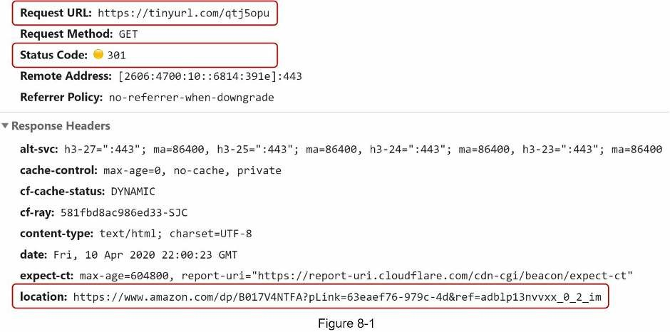

Giao tiếp chi tiết giữa client và server được hiển thị trong hình 8-2.

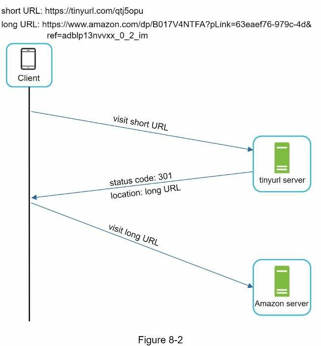

Thứ cần thảo luận ở đây là hai status code: *301 redirect* và *302 redirect*.

- **301 redirect:** status code này cho thấy rằng URL được yêu cầu sẽ được chuyển "vĩnh viễn" sang URL dài. Vì nó được chuyển hướng vĩnh viễn, trình duyệt lưu phản hồi vào bộ nhớ cache và các yêu cầu tiếp theo cho cùng một URL sẽ không được gửi đến dịch vụ rút gọn URL nữa. Thay vào đó, các yêu cầu được chuyển hướng trực tiếp đến server của URL dài.
- **302 redirect:** status code này có nghĩa là URL được chuyển "tạm thời" sang URL dài, có nghĩa là các yêu cầu tiếp theo cho cùng một URL sẽ được gửi đến dịch vụ rút gọn URL trước. Sau đó, chúng được chuyển hướng đến server của URL dài.

Mỗi phương pháp chuyển hướng đều có ưu và nhược điểm của nó. Nếu ưu tiên là giảm tải cho server, việc sử dụng 301 redirect sẽ tốt hơn vì chỉ yêu cầu đầu tiên của cùng một URL là được gửi đến các server rút gọn URL. Tuy nhiên, nếu vấn đề phân tích được chú trọng, nên lựa chọn 302 redirect vì nó có thể theo dõi tỷ lệ click và nguồn click chuột dễ dàng hơn.

Cách thông thường nhất cho triển khai chuyển hướng URL là dùng bảng băm. Giả sử bảng băm lưu trữ cặp `<shortURL, longURL>`, chuyển hướng URL có thể triển khai như sau:
- Lấy URL dài: longURL = hashTable.get(shortURL)
- Sau khi lấy được rồi thì thực hiện chuyển hướng URL.

### Rút gọn URL

Giả sử URL ngắn có dạng: www.tinyurl.com/{hashValue}. Để hỗ trợ việc rút gọn URL, ta phải dùng một hàm băm `fx` để ánh xạ các URL dài sang `hashValue`, như hình 8-3/

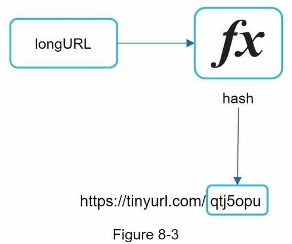

Hàm băm phải đáp ứng các yêu cầu sau:
- Mỗi *longURL* phải được băm với một *hashValue*.
- Mỗi *hashValue* phải được ánh xạ ngược lại với *longURL*.

Chi tiết thiết kế cho hàm băm sẽ được thảo ở đi sâu vào thiết kế.

## 3. Đi sâu vào thiết kế

Cho tới bây giờ, ta đã thảo luận về các thiết kế high-level của chuyển hướng và rút gọn URL. Bây giờ, ở phần này ta sẽ đi sâu vào mô hình dữ liệu, hàm băm, rút gọn URL và chuyển hướng URL.

### Mô hình dữ liệu

Trong thiết kế high-level, tất cả mọi thứ lưu ở bảng băm. Đó là một điểm khởi đầu tốt, tuy nhiên cách tiếp cận này không khả thi trong các hệ thống ở thế giới thực vì nguồn tài nguyên hạn chế và đắt đỏ. Lựa chọn tốt hơn là lưu `<shortURL, longURL>` trong cơ sở dữ liệu quan hệ. Hình 8-4 cho thấy một thiết kế bảng đơn giản trong cơ sở dữ liệu. Phiên bản đơn giản của bảng bao gồm 3 cột là: `id`, `shortURL` và `longURL`.

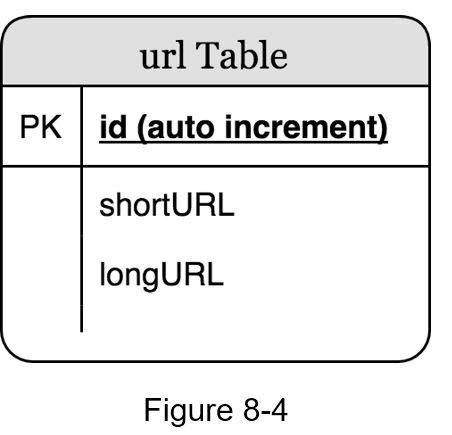

### Hàm băm

Hàm băm dùng cho băm một URL dài thành URL ngắn, còn gọi là `hashValue`.

#### Độ dài giá trị băm

`hashValue` bao gồm các ký tự từ [0-9, a-z, A-Z], chứa 10 + 26 + 26 = 62 ký tự có thể. Để tính độ dài của `hashValue`, hãy tìm n nhỏ nhất sao cho 62 ^ n ≥ 365 tỷ. Hệ thống phải hỗ trợ tối đa 365 tỷ URL dựa trên ước tính nhanh cho nó. Bảng 8-1 cho thấy độ dài của `hashValue` và số lượng URL tối đa tương ứng mà nó có thể hỗ trợ.

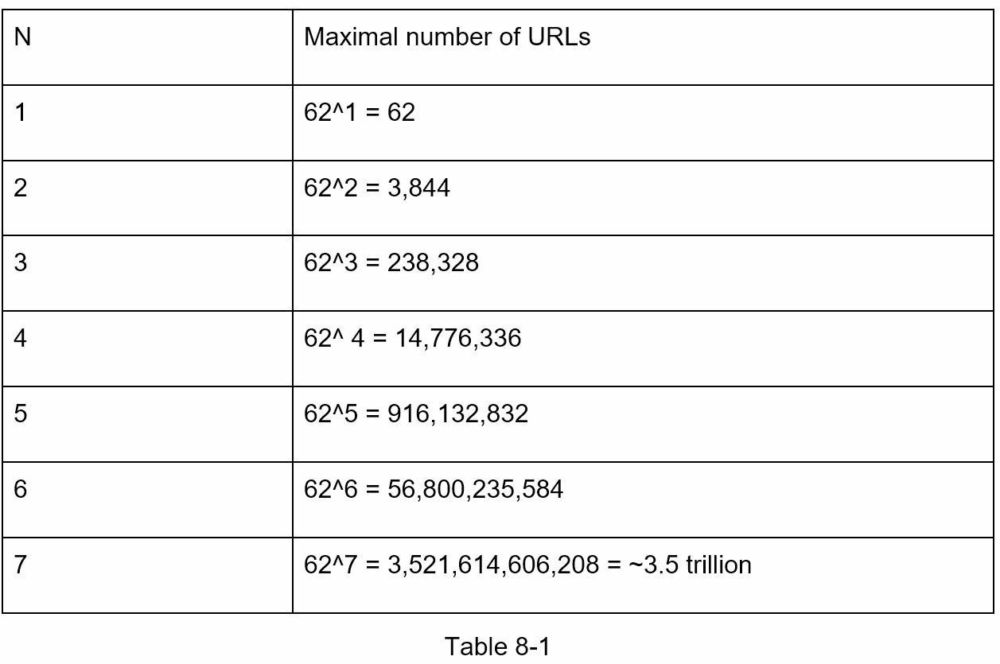

Khi n = 7, 62 ^ n = ~ 3,5 nghìn tỷ thì 3,5 nghìn tỷ là quá đủ để chứa 365 tỷ URL, vì vậy độ dài của hashValue là 7.

Chúng ta sẽ khám phá hai loại hàm băm cho trình rút gọn URL. Cái đầu tiên là "hash + collision resolution" và cái thứ hai là "base 62 conversion". Chúng ta hãy xem xét từng cái một.

#### Hash + collision resolution

Để rút gọn URL dài, ta nên triển khai một hàm băm để băm một URL dài thành chuỗi 7 ký tự. Cách tiếp cận thẳng thắn là sử dụng một hàm băm phổ biến như CRC32, MD5 và SHA-1. Bảng sau so sánh kết quả băm sau khi áp dụng các hàm băm khác nhau cho cùng một URL: https://en.wikipedia.org/wiki/Systems_design.

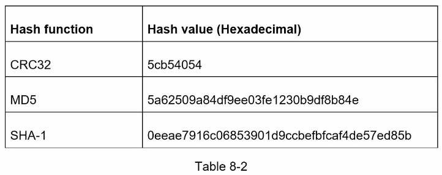

Như thể hiện trong Bảng 8-2, ngay cả giá trị băm ngắn nhất (từ CRC32) cũng quá dài (hơn 7 ký tự). Làm thế nào chúng ta có thể làm cho nó ngắn hơn?

Cách tiếp cận đầu tiên là thu thập 7 ký tự đầu tiên của một giá trị băm; tuy nhiên, phương pháp này có thể dẫn đến xung đột băm. Để giải quyết xung đột băm, chúng ta có thể nối đệ quy một chuỗi mới được xác định trước cho đến khi không phát hiện ra xung đột nào nữa. Quá trình này được giải thích trong Hình 8-5.

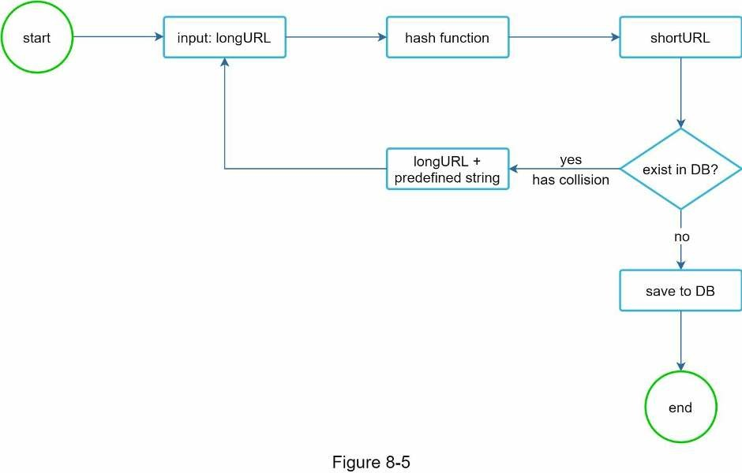

Phương pháp này có thể loại bỏ xung đột; tuy nhiên, rất tốn kém khi truy vấn cơ sở dữ liệu để kiểm tra xem shortURL có tồn tại cho mọi yêu cầu hay không. Một kỹ thuật được gọi là bộ lọc bloom [2] có thể cải thiện hiệu suất. Bộ lọc bloom là một cấu trúc dữ liệu xác suất để kiểm tra xem một phần tử có nằm trong một tập hợp hay không. Tham khảo tài liệu [2] để biết thêm chi tiết.

#### Base 62 conversion

Base conversion - chuyển đổi cơ số là một cách tiếp cận khác thường được sử dụng cho các trình rút ngắn URL. Chuyển đổi cơ số giúp chuyển đổi cùng một số giữa các hệ thống biểu diễn số khác nhau của nó. Chuyển đổi cơ số 62 được sử dụng vì có 62 ký tự có thể có cho `hashValue`. Giờ ta sử dụng một ví dụ để giải thích cách hoạt động của nó: chuyển đổi 11157 cơ số 10 thành biểu diễn cơ số 62.

- Từ tên gọi, cơ số 62 sử dụng 62 ký tự cho mã hoá. Ánh xạ tương ứng 0-0,..., 9-9, 10-a, 11-b,..., 35-z, 36-A,..., 61-Z.
- 11157 = 2 * 62^2 + 55 * 62^1 + 59 * 62^0 = [2, 55, 59] -> [2, T, X] trong biểu diễn cơ số 62. Ảnh 8-6 minh hoạ quá trình này:

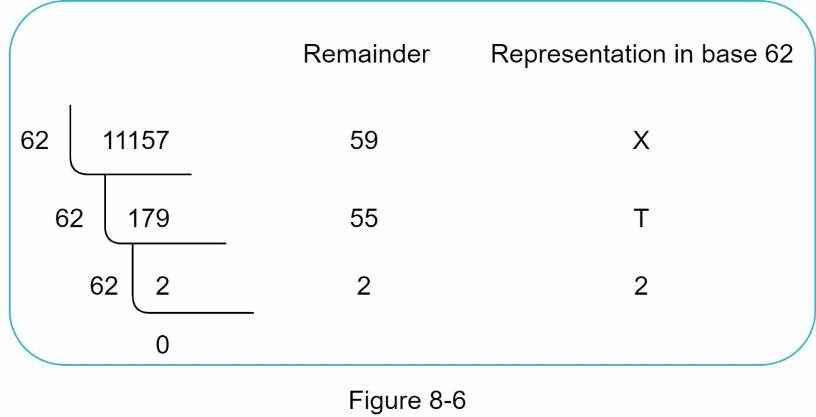

Do đó, URL ngắn là `https://tinyurl.com/2TX`

#### So sánh hai giải pháp

Bảng dưới đây so sánh hai giải pháp

| Băm + giải pháp xung đột | Chuyển đổi cơ số 62 |
|-|-|
| Độ dài URL ngắn là cố định | Độ dài URL ngắn có thể tăng với ID |
| Không cần tạo ra ID duy nhất | Dựa trên việc tạo ID duy nhất |
| Xung đột có thể xảy ra và cần giải quyết | Xung đột không thể xảy ra vì ID là duy nhất |
| Không thể tìm ra URL ngắn kế tiếp vì nó không dựa trên ID | Dễ dàng tìm ra URL ngắn kế tiếp bằng tăng lên 1. Đây là một vấn đề về bảo mật |


### Đào sâu thiết kế rút gọn URL

Là một trong những phần cốt lõi của hệ thống, chúng ta muốn quy trình rút gọn URL phải có logic và chức năng đơn giản. Chuyển đổi cơ số 62 được sử dụng trong thiết kế. Chúng ta xây dựng sơ đồ sau (Hình 8-7) để minh hoạ luồng hoạt động như sau:

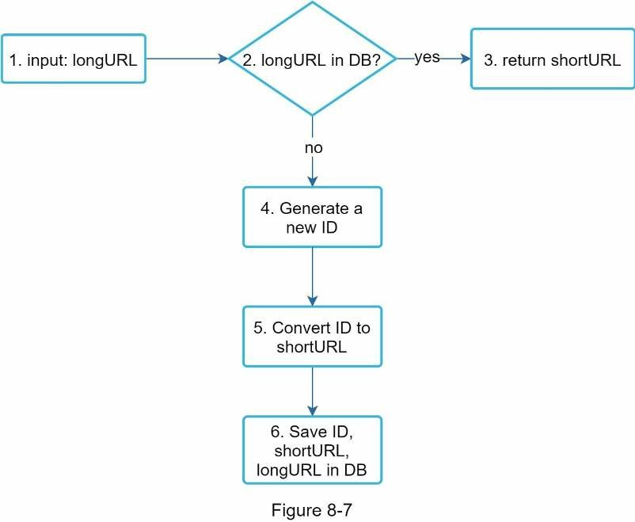

1. Đầu vào (input) là longURL.
2. Hệ thống kiểm tra nếu longURL có trong cơ sơ dữ liệu.
3. Nếu có, nghĩa là longURL đã được chuyển thành shortURL trước đây. Như vậy, ta chỉ cần tìm nạp shortURL từ cơ sở dữ liệu và trả về client.
4. Nếu không. Một ID duy nhất mới (khoá chính) được tạo bởi bộ tạo ID duy nhất.
5. Chuyển ID thành shortURL với chuyển đổi cơ số 62.
6. Tạo một bảng ghi mới trong cơ sở dữ liệu với ID, shortURL và longURL.

Để hiểu luồng hoạt động đơn giản, hãy xem một ví dụ cụ thể.

1. URL đầu vào là `https://en.wikipedia.org/wiki/Systems_design`.
2. Bộ tạo ID duy nhất trả về ID là: 2009215674938.
3. Chuyển ID sang hệ cơ số 62 để có được shortURL: ID(2009215674938) được chuyển thành **zn9edcu**.
4. Lưu ID, shortURL và URL vào cơ sở dữ liệu như hình bên dưới.

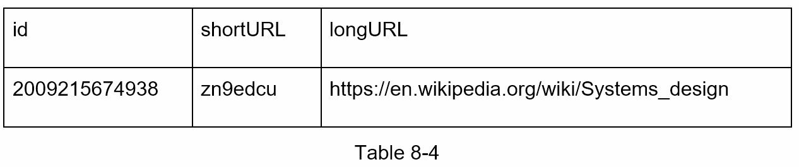

Trình tạo ID duy nhất là điều đáng quan tâm. Chức năng chính của nó là tạo ID duy nhất trên toàn cục, được sử dụng để tạo shortURL. Trong một môi trường phân tán cao, việc triển khai một trình tạo ID duy nhất là một thách thức. May mắn thay, chúng ta đã thảo luận về một số giải pháp trong [Chương 7: Thiết kế một bộ tạo ID duy nhất trong các hệ thống phân tán](https://ren0503.github.io/sdi/chapter7). Bạn có thể tham khảo lại trong trườngh hợp đã quên.

### Đào sâu thiết kế chuyển hướng URL

Hình 8-8 cho thấy thiết kế chi tiết của chuyển hướng URL. Vì các thao tác đọc nhiều hơn ghi, nên ánh xạ `<shortURL, longURL>` được lưu trữ trong bộ nhớ đệm cache để cải thiện hiệu suất.

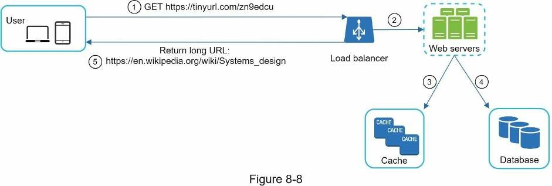

Luồng hoạt động của chuyển hướng URL được mô tả như sau:

1. Người dùng click vào URL đã rút gọn như: `https://tinyurl.com/zn9edcu`.
2. Bộ cân bằng tải chuyển tiếp yêu cầu đến các web server.
3. Nếu shortURL có trong bộ đệm, trả về longURL trực tiếp.
4. Nếu không, tìm nạp longURL từ cơ sở dữ liệu. Trong trường hợp không có trong cơ sở dữ liệu nghĩa là người dùng nhập shortURL không hợp lệ.
5. Trả về longURL cho người dùng.

## 4. Tổng kết

Trong chương này, chúng ta đã nói về thiết kế API, mô hình dữ liệu, hàm băm, rút gọn URL và chuyển hướng URL.

Nếu có thêm thời gian vào cuối cuộc phỏng vấn, đây là một vài điểm cần nói thêm.
- Bộ giới hạn truy cập: Một vấn đề bảo mật tiềm ẩn mà chúng ta có thể gặp phải là người dùng độc hại gửi một số lượng lớn các yêu cầu rút gọn URL. Bộ giới hạn truy cập giúp lọc ra các yêu cầu dựa trên địa chỉ IP hoặc các quy tắc lọc khác. Nếu bạn muốn làm mới bộ nhớ của mình về giới hạn truy cập, hãy tham khảo [Chương 4: Thiết kế bộ giới hạn truy cập](https://ren0503.github.io/sdi/chapter4).
- Mở rộng web server: Vì web tier là stateless, nên dễ dàng mở rộng web tier bằng cách thêm hoặc xóa các web server.
- Mở rộng cơ sở dữ liệu: Sao chép (replication) và phân bổ (sharding) cơ sở dữ liệu là những kỹ thuật phổ biến.
- Phân tích: Dữ liệu ngày càng quan trọng đối với thành công của doanh nghiệp. Tích hợp giải pháp phân tích vào trình rút gọn URL có thể giúp trả lời các câu hỏi quan trọng như có bao nhiêu người click vào một liên kết? Khi nào họ click vào liên kết?...
- Tính khả dụng, tính nhất quán và độ tin cậy. Những khái niệm này là cốt lõi của sự thành công của bất kỳ hệ thống lớn nào. Chúng ta đã thảo luận chi tiết về chúng trong [Chương 1](../chapter1/README.md), hãy làm mới bộ nhớ của bạn về những chủ đề này.

# Tham khảo

[1] A RESTful Tutorial: https://www.restapitutorial.com/index.html

[2] Bloom filter: https://en.wikipedia.org/wiki/Bloom_filter