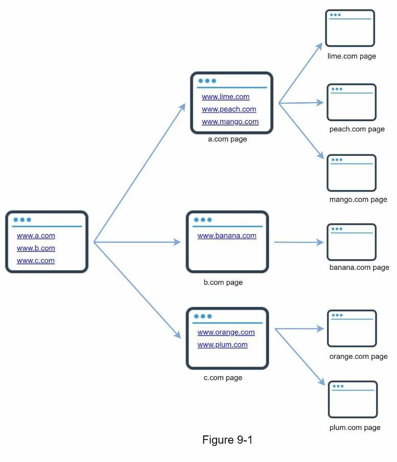
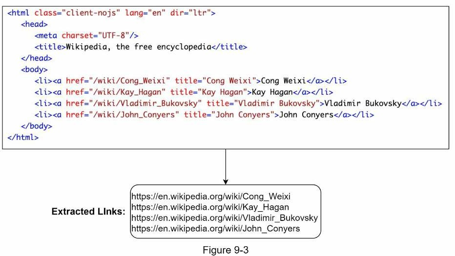
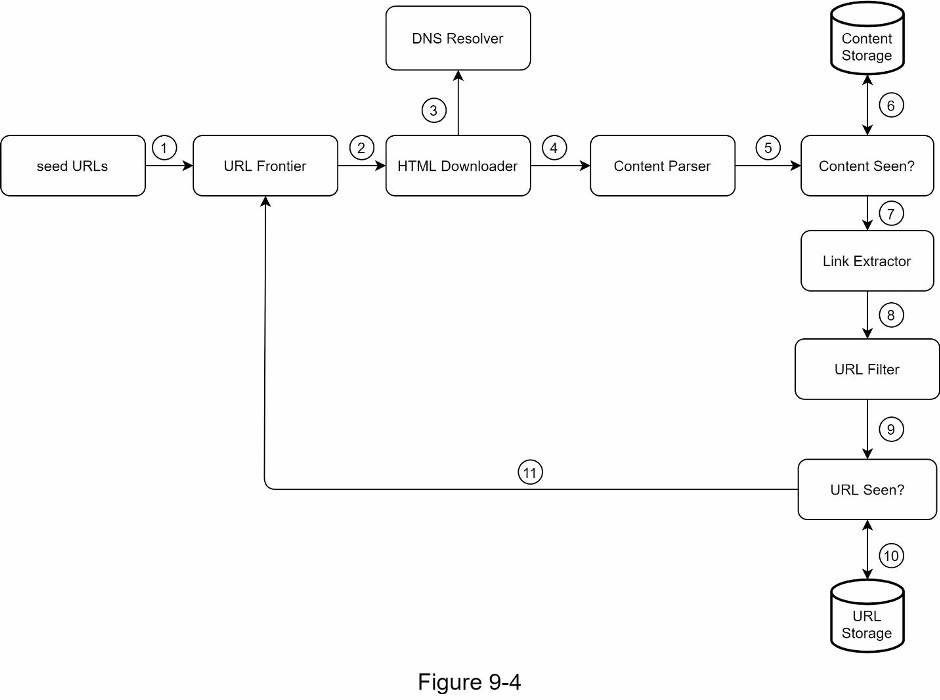
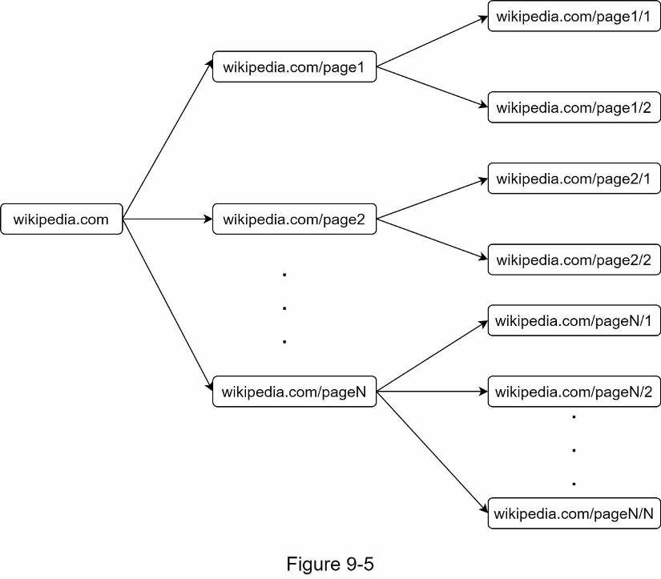
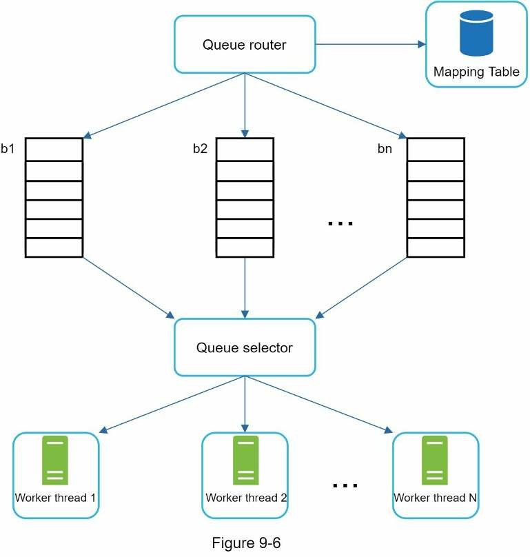
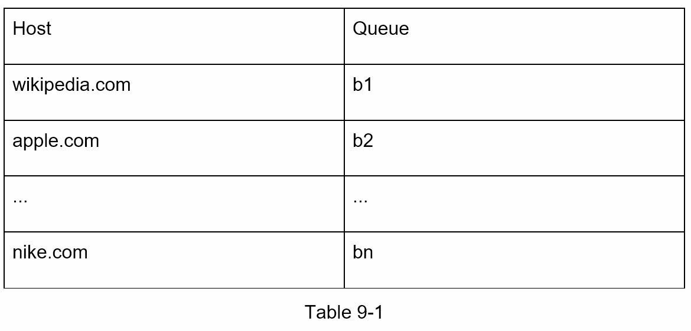
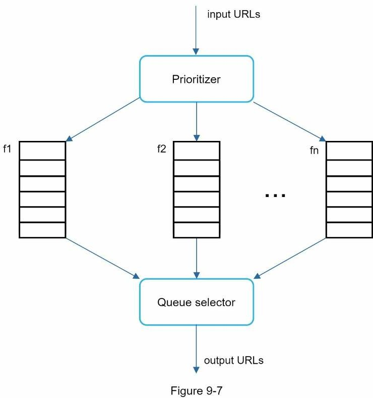
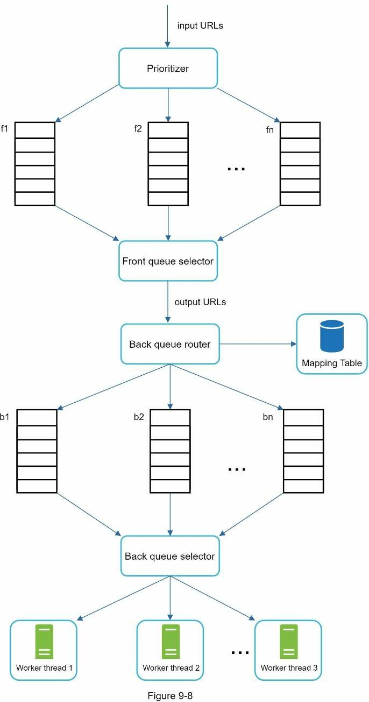
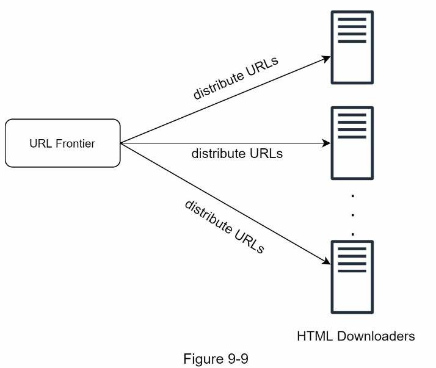
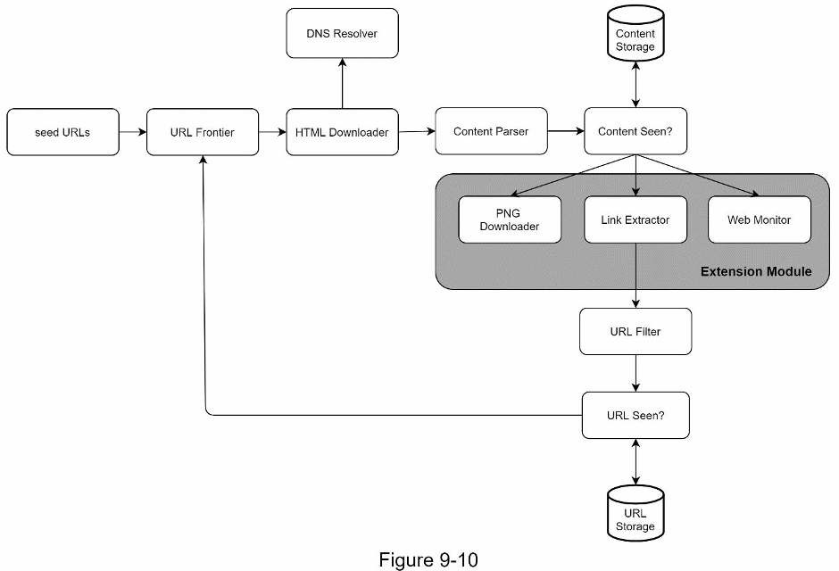

# Chapter 9: Thiết Kế một Web Crawler

Ở chương này ta sẽ tập trung thiết kế một web crawler. Một web crawler (tạm dịch là trình thu thập thông tin web) còn biết đến như một robot. Nó được dùng bởi các công cụ tìm kiếm để khám phá nội dung mới cập nhật từ web. Nội dung có thể là trang web, hình ảnh, video, file PDF,... Một web crawler hoạt động bằng cách thu thập một vài trang web và theo dõi liên kết của các trang web này để thu thập nội dung mới. Ảnh bên dưới mô tả quá trình thu thập thông tin - crawl.



Một crawler được dùng cho các mục đích sau:
- **Search engine indexing:** Đây là trường hợp sử dụng phổ biến nhất. Web crawler thu thập các trang web để tạo chỉ mục cục bộ cho các công cụ tìm kiếm. Ví dụ: Googlebot là web crawler đằng sau công cụ tìm kiếm Google.
- **Web archiving:** Đây là quá trình thu thập thông tin từ web để bảo toàn dữ liệu cho những lần sử dụng sau. Ví dụ, nhiều thư viện quốc gia chạy crawler để lưu trữ các trang web. Các ví dụ đáng chú ý là Thư viện Quốc hội Hoa Kỳ [1] và kho lưu trữ web của Liên minh Châu Âu [2].
- **Web mining:** Sự phát triển bùng nổ của web mang lại cơ hội chưa từng có cho việc khai thác dữ liệu. Khai thác web giúp khám phá kiến thức hữu ích từ internet. Ví dụ: các công ty tài chính hàng đầu sử dụng crawler để tải xuống các cuộc họp cổ đông và báo cáo hàng năm để tìm hiểu các sáng kiến quan trọng của công ty.
- **Web monitoring:** Web crawler giúp theo dõi các vi phạm bản quyền và nhãn hiệu qua Internet. Ví dụ: Digimarc [3] sử dụng crawler để tìm các tác phẩm và báo cáo vi phạm bản quyền.

Mức độ phức tạp của việc phát triển web crawler phụ thuộc vào quy mô mà chúng ta dự định hỗ trợ. Đó có thể là một dự án trường học nhỏ, chỉ mất vài giờ để hoàn thành hoặc một dự án khổng lồ đòi hỏi sự cải tiến liên tục từ một nhóm kỹ sư chuyên dụng. Như vậy, chúng ta cùng tìm hiểu thang đo và các tính năng cần hỗ trợ bên dưới.

## 1. Hiểu vấn đề và thiết lập phạm vi

Thuật toán cơ bản của một web crawler đơn giản như sau:
1. Cho một tập URL, tải tất cả địa chỉ trang web bằng các URL.
2. Mở rộng URL từ các trang web này.
3. Thêm các URL mới vào danh sách URL để tải xuống. Lặp lại 3 bước này.

Một web crawler có hoạt động thực sự đơn giản như thuật toán cơ bản này không? Không hề. Thiết kế một web crawler có khả năng mở rộng rộng lớn là một nhiệm vụ cực kỳ phức tạp. Không ai có thể thiết kế một web crawler lớn trong thời gian phỏng vấn. Trước khi bắt đầu thiết kế, chúng ta phải đặt câu hỏi để hiểu các yêu cầu và thiết lập phạm vi thiết kế:

- **Ứng viên:** Mục đích chính của web crawler là gì? Nó được sử dụng để đánh chỉ mục công cụ tìm kiếm, khai thác dữ liệu hay là thứ gì khác?
- **Người phỏng vấn:** Đánh chỉ mục công cụ tìm kiếm.

- **Ứng viên:** Web crawler thu thập bao nhiêu trang web mỗi tháng?
- **Người phỏng vấn:** 1 tỷ trang.

- **Ứng viên:** Gồm những dạng nội dung nào? Chỉ HTML hay các loại nội dung khác như PDF và hình ảnh?
- **Người phỏng vấn:** Chỉ HTML.

- **Ứng viên:** Chúng ta có xem xét các trang web mới được thêm vào hay đã được chỉnh sửa không?
- **Người phỏng vấn:** Có, chúng ta nên xem xét các trang web mới được thêm vào hoặc chỉnh sửa.

- **Ứng viên:** Chúng ta có cần lưu trữ các trang HTML được thu thập thông tin từ web không?
- **Người phỏng vấn:** Có, tối đa 5 năm.

- **Ứng viên:** Chúng ta xử lý các trang web có nội dung trùng lặp như thế nào?
- **Người phỏng vấn:** Nên bỏ qua các trang có nội dung trùng lặp.

Trên đây là một số câu hỏi mẫu mà bạn có thể hỏi người phỏng vấn của mình. Điều quan trọng là phải hiểu các yêu cầu và làm rõ những điều còn mơ hồ. Ngay cả khi bạn được yêu cầu thiết kế một sản phẩm đơn giản như web crawler, bạn và người phỏng vấn của bạn vẫn có thể không có cùng suy nghĩa.

Bên cạnh các chức năng cần làm rõ với người phỏng vấn, bạn cũng cần lưu ý các đặc điểm sau của một web crawler tốt:
- Khả năng mở rộng: Hệ thống web rất lớn. Có hàng tỷ trang web trên mạng. Thu thập thông tin web sẽ cực kỳ hiệu quả bằng cách sử dụng song song.
- Tính chắc chắn: Trang web có rất nhiều cạm bẫy. HTML kém, server không phản hồi, sự cố, liên kết độc hại,... đều phổ biến. Web crawler phải xử lý tất cả các trường hợp đó.
- Lịch sự: Web crawler không nên đưa ra quá nhiều yêu cầu đối với một trang web trong một khoảng thời gian ngắn.
- Khả năng mở rộng: Hệ thống linh hoạt nên cần có những thay đổi tối thiểu để hỗ trợ các loại nội dung mới. Ví dụ, nếu chúng ta muốn thu thập dữ liệu các file hình ảnh trong tương lai, chúng ta không cần phải thiết kế lại toàn bộ hệ thống.

### Ước lượng nhanh

Các ước tính sau dựa trên các giả định, điều quan trọng là bạn và người phỏng vấn phải có chung tư tưởng.
- Giả sử tải 1 tỷ trang web mỗi tháng.
- QPS: 1,000,000,000 / 30 ngày / 24 giờ / 3600 giây = ~400 trang trên giây.
- QPS cao nhất: 2 * QPS = 800
- Giả sử kích cở trung bình của trang web là 500 KB.
- 1 tỷ trang web * 500 KB = 500 TB lưu trữ hàng tháng.
- Giả sử dữ liệu dùng trong 5 năm. 500 TB * 12 tháng * 5 năm = 30 PB. Cần bộ lưu trữ 30 PB để dùng cho 5 năm.

## 2. Đề xuất thiết kế high-level

Khi các yêu cầu đã rõ ràng, chúng ta sẽ chuyển sang thiết kế high-level. Lấy cảm hứng từ các nghiên cứu trước đây về thu thập thông tin web [4] [5], chúng ta có một thiết kế đề xuất như trong Hình 9-2.


Đầu tiên, ta khám phá mỗi thành phần của thiết kế để hiểu chức năng của chúng. Sau đó ta xem xét luồng hoạt động của crawler theo từng bước.

### Seed URLs

Một web crawler sử dụng seed URL như điểm bắt đầu cho quá trình thu thập thông tin. Ví dụ, dể thu thập thông tin tất cả các trang web từ trang web của trường đại học, một cách trực quan để chọn seed URL là sử dụng tên miền của trường đại học.

Để thu thập dữ liệu toàn bộ trang web, chúng ta cần phải sáng tạo trong việc chọn các seed URL. Một seed URL tốt đóng vai trò là điểm khởi đầu tốt mà web crawler có thể sử dụng để duyệt qua nhiều liên kết nhất có thể. Chiến lược chung là chia toàn bộ không gian URL thành những không gian nhỏ hơn. Cách tiếp cận được đề xuất đầu tiên dựa trên địa phương vì các quốc gia khác nhau có thể có các trang web phổ biến khác nhau. Một cách khác là chọn các seed URL dựa trên các chủ đề; ví dụ: chúng tôi có thể chia không gian URL thành mua sắm, thể thao, chăm sóc sức khỏe, ... Lựa chọn seed URL là một câu hỏi mở. Bạn không nên mong đợi việc đưa ra câu trả lời hoàn hảo. Chỉ cần nói ra suy nghĩ của mình.

### URL Frontier

Hầu hết các web crawler hiện đại chia trạng thái thu thập thông tin thành hai phần: sẽ tải xuống và đã tải xuống. Thành phần lưu trữ các URL sẽ tải xuống gọi là URL Frontier. Bạn có thể xem nó như một hàng đợi FIFO (First-in-First-out). Để biết chi tiết hãy xem ở phần chuyên sâu.

### HTML Downloader

Trình tải xuống HTML tải các trang web từ internet. Các URL đó được cung cấp bởi URL Frontier.

### DNS Resolver

Để tải xuống một trang web, một URL phải được dịch thành địa chỉ IP. Trình tải xuống HTML gọi DNS Resolver để lấy địa chỉ IP tương ứng cho URL. Ví dụ: URL `www.wikipedia.org` được chuyển đổi thành địa chỉ IP 198.35.26.96 kể từ ngày 3/5/2019.

### Content Parser

Sau khi một trang web được tải xuống, nó phải được phân tích cú pháp và xác thực vì các trang web không đúng định dạng có thể gây ra sự cố và lãng phí dung lượng lưu trữ. Việc triển khai content parser trong server crawl sẽ làm chậm quá trình thu thập thông tin. Do đó, content parser nên là một thành phần riêng biệt.

### Content Seen?

Nghiên cứu trực tuyến [6] cho thấy 29% trang web có nội dung trùng lặp với nhau, điều này có thể khiến cùng một nội dung được lưu trữ nhiều lần. Chúng ta sử dụng cấu trúc dữ liệu "Content Seen?" để loại bỏ sự dư thừa dữ liệu và rút ngắn thời gian xử lý. Nó giúp phát hiện nội dung mới đã được lưu trữ trước đó trong hệ thống. Để so sánh hai tài liệu HTML, chúng ta có thể so sánh chúng theo từng ký tự. Tuy nhiên, phương pháp này chậm và tốn thời gian, đặc biệt là khi có hàng tỷ trang web. Một cách hiệu quả hơn để hoàn thành nhiệm vụ này là so sánh các giá trị băm của hai trang web [7].

### Content Storage

Là một hệ thống lưu trữ cho lưu nội dung HTML. Lựa chọn hệ thống lưu trữ dựa trên các nhân tố như kiểu dữ liệu, kích thước dữ liệu, tần suất truy cập, ... Cả ổ đĩa và bộ nhớ đều được sử dụng.
- Phần lớn nội dung được lưu trên ổ đĩa vì tập dữ liệu quá lớn so với bộ nhớ.
- Nội dung phổ biến được giữ trong bộ nhớ để giảm độ trễ.

### URL Extractor

URL Extractor phân tích và mở rộng liên kết từ trang HTML. Hình 9-3 là một ví dụ về quá trình mở rộng liên kết. Các đường dẫn tương đối được chuyển đổi thành URL tuyệt đối bằng cách thêm vào tiền tố "https://en.wikipedia.org"



### URL Filter

Bộ lọc URL loại trừ một số loại nội dung, file mở rộng, liên kết lỗi và URL trong các trang web nằm trong "danh sách đen".

### URL Seen?

"URL Seen?" là một cấu trúc dữ liệu theo dõi các URL đã truy cập trước đó hoặc có trong Frontier. "URL Seen?" giúp tránh các URL trùng lặp nhiều lẫn dẫn đến quá tải cho server và nguy cơ gây ra vòng lặp vô tận.

Bộ lọc bloom và bảng băm là hai kỹ thuật phổ biến để triển khai thành phần "URL Seen?". Chúng ta sẽ không đề cập đến việc triển khai chi tiết bộ lọc bloom và bảng băm ở đây. Để biết thêm thông tin, hãy tham khảo các tài liệu tham khảo [4] [8]. 

### URL Storage

Bộ lưu trữ các URL đã truy cập.

Cho đến giờ, chúng ta đã thảo luận về mọi thành phần hệ thống. Tiếp theo, chúng ta tập hợp chúng lại với nhau để giải thích luồng hoạt động của chúng.

### Luồng hoạt động của web crawler



Bước 1: Thêm seed URL vào URL Frontier

Bước 2: HTML Downloader tìm nạp một danh sách URL từ URL Frontier.

Bước 3: HTML Downloader lấy địa chỉ IP của URL từ DNS Resolver và bắt đầu tải xuống.

Bước 4: Content Parser phân tích trang HTML và kiểm tra nếu trang sai định dạng.

Bước 5: Sau khi nội dung được phân tích và xác thực, nó sẽ được truyền xuống thành phần "Component Seen?"

Bước 6: Thành phần "Content Seen" kiểm tra nếu một trang HTML đã tồn tại trong bộ lưu trữ chưa.
- Nếu đã có trong bộ lưu trữ, điều này có nghĩa là cùng nội dung trong một URL khác đã được xử lý. Trong trường hợp này, trang HTML sẽ bị huỷ.
- Nếu nó không có trong bộ lưu trữ, hệ thống đã không xử lý nội dung giống vậy trước đó. Nội dung được chuyển đến Link Extractor.

Bước 7: Link Extractor mở rộng liên kết từ các trang HTML.

Bước 8: Liên kết đã mở rộng được chuyển đến URL Filter.

Bước 9: Sau khi liên kết được lọc, nó được chuyển đến "URL Seen?".

Bước 10: Thành phần "URL Seen" kiểm tra nếu một URL đã có trong bộ lưu trữ, nếu có nó đã được xử lý trước đây, và không cần phải làm gì cả.

Bước 11: Nếu không, nó sẽ được thêm vào URL Frontier.

## 3. Đi sâu vào thiết kế

Bây giờ, ta sẽ thảo luận về cách xây dựng các thành phần quan trọng và các kỹ thuật chuyên sâu:
- Depth-first search (DFS) vs Breadth-first search (BFS)
- URL frontier
- HTML Downloader
- Độ bền
- Khả năng mở rộng
- Phát hiện và tránh nội dung có vấn đề

### DFS vs BFS

Bạn có thể nghĩ về web như một đồ thị có hướng nơi mà các trang web như là các đỉnh còn các liên kết (URL) là các cạnh. Quá trình thu thập thông tin có thể xem như là duyệt qua đồ thị có hướng từ một trang web đến các trang web khác. Hai thuật toán duyệt đồ thị phổ biến nhất là DFS và BFS. Tuy nhiên, DFS thường không phải lựa chọn tốt vì nó có thể rất sâu.

BFS phổ biến hơn, được dùng bởi các web crawler và được triển khai bằng hàng đợi FIFO. Trong hàng đợi FIFO, các URL được lấy ra theo thứ tự mà nó đi vào. Tuy nhiên, triển khai này có hai vấn đề.
- Hầu hết liên kết từ cùng một trang web được liên kết từ cùng một host. Trong hình 9-5, tất cả liên kết trong `wikipedia.com` là liên kết nội bộ, khiến crawler bận rộn xử lý các URL đến từ cùng một host (wikipedia.com). Khi crawler cố gắng tải xuống các trang web song song, server Wikipedia sex bị ngập bởi các yêu cầu. Điều này được gọi là "impolite" (bất lịch sự).




- BFS tiêu chuẩn không xem xét mức độ ưu tiên của một URL. Hệ thống web rất lớn và không phải trang nào cũng có chất lượng và mức độ quan trọng như nhau. Do đó, chúng ta có thể muốn ưu tiên các URL theo xếp hạng trang, lưu lượng truy cập web, tần suất cập nhật,...

### URL Frontier

URL Frontier giúp giải quyết những vấn đề này. URL frontier là một cấu trúc dữ liệu lưu trữ các URL sẽ được tải xuống. URL frontier là một thành phần quan trọng để đảm bảo tính lịch sự, mức độ ưu tiên của URL và sự mới mẻ. Một vài tài liệu đáng chú ý về URL frontier được đề cập trong tài liệu tham khảo [5] [9]. Kết quả từ những bài báo này như sau:

#### Politeness

Nói chung, web crawler nên tránh gửi quá nhiều yêu cầu đến cùng một hosting server trong một khoảng thời gian ngắn. Gửi quá nhiều yêu cầu được coi là "bất lịch sự - impolite" hoặc thậm chí bị coi là tấn công từ chối dịch vụ (DOS). Ví dụ: nếu không có bất kỳ ràng buộc nào, crawler có thể gửi hàng nghìn yêu cầu mỗi giây đến cùng một trang web. Điều này có thể quá tải các web server.

Ý tưởng chung để thực thi phép lịch sự là tải xuống từng trang một từ cùng một host. Có thể thêm thời gian trễ giữa hai tác vụ tải xuống. Ràng buộc lịch sự được thực hiện bằng cách duy trì ánh xạ từ hostname của trang web để tải xuống các luồng (worker). Mỗi luồng tải xuống có một hàng đợi FIFO riêng biệt và chỉ tải xuống các URL thu được từ hàng đợi đó. Hình 9-6 cho thấy thiết kế quản lý tính lịch sự.



- Queue router: đảm bảo rằng mỗi hàng đợi (b1, b2, ..., bn) chỉ bảo gồm các URL từ cùng một host.
- Mapping table: ánh xạ từng host với từng hàng đợi.



- Các hàng đợi FIFO từ b1, b2 đến bn: mỗi hàng đợi bao gồm URL từ cùng một host.
- Queue selector: Mỗi luồng worker được ánh xạ tới hàng đợi FIFO, và chỉ tải xuống các URL của hàng đợi đó. Logic chọn hàng đợi được thực hiện bởi query selector.
- Luồng worker từ 1 đến N. Luồng woker tải các trang web xuống từng lượt một của cùng một host. Có thể thêm độ trễ vào giữa hai tác vụ tải xuống.

#### Priority

Một bài đăng ngẫu nhiên từ một diễn đàn thảo luận về các sản phẩm của Apple có trọng lượng rất khác so với các bài đăng trên trang chủ của Apple. Mặc dù cả hai đều có từ khóa "Apple", nhưng việc thu thập thông tin trang chủ của Apple trước tiên là điều hợp lý.

Chúng ta nên ưu tiên các URL dựa trên mức độ hữu ích, có thể được đo lường bằng PageRank [10], lưu lượng truy cập trang web, tần suất cập nhật, ... Prioritizer là thành phần xử lý mức độ ưu tiên của URL. Tham khảo tài liệu [5] [10] để có thông tin chuyên sâu về khái niệm này.

Hình 9-7 cho thấy thiết kế quản lý mức độ ưu tiên của URL



- Prioritizer: Nhận các URL đầu vào và tính toán mực độ ưu tiên.
- Hàng đợi từ f1 đến fn: Mỗi hàng đợi có một mức độ ưu tiên được chỉ định. Các hàng có mức độ ưu tiên cao được chọn với xác suất cao hơn.
- Query selector: Chọn ngẫu nhiên một hàng đợi có thiên hướng đối với hàng đợi có mức độ ưu tiên cao hơn.

Hình 9-8 biểu diễn thiết kế URL frontier và bao gồm 2 module:
- Front queue: Quản lý mức độ ưu tiên
- Back queue: Quản lý tính lịch sự



#### Freshness

Các trang web liên tục được thêm, xóa và chỉnh sửa. Web crawler phải thu thập lại thông tin định kỳ các trang đã tải xuống để giữ cho tập dữ liệu của chúng ta luôn mới. Thu thập lại thông tin tất cả các URL sẽ tiêu tốn nhiều thời gian và tài nguyên. Một số chiến lược để tối ưu hóa việc làm mới được liệt kê như sau:
- Thu thập lại thông tin dựa trên lịch sử cập nhật của các trang web
- Ưu tiên các URL và thu thập lại thông tin các trang quan trọng trước tiên và thường xuyên hơn.

#### Bộ lưu trữ cho URL Frontier

Việc thu thập thông tin trong thế giới thực cho các công cụ tìm kiếm, sô lượng các URL trong frontier có thể lên đến hàng trăm triệu [4]. Đưa mọi thứ vào bộ nhớ sẽ không lâu bền cũng như không thể mở rộng. Giữ mọi thứ trong đĩa không phải là điều mà ta mong muốn vì đĩa rất chậm; và nó có thể dễ dàng trở thành nút thắt cổ chai cho quá trình thu thập thông tin.

Nên chúng ta sẽ áp dụng một phương pháp kết hợp. Phần lớn các URL được lưu trữ trên đĩa, vì vậy không gian lưu trữ không phải là vấn đề. Để giảm chi phí đọc và ghi vào đĩa, chúng ta duy trì bộ đệm trong bộ nhớ cho các hoạt động enqueue/dequeue. Dữ liệu trong bộ đệm được ghi định kỳ vào đĩa.

### HTML Downloader

HTML Downloader tải xuống các trang web từ internet bằng giao thức HTTP. Trước khi thảo luận HTML Downloader, ta nên xem qua giao thức Robots Exclusion trước.

#### Robots.txt

Robots.txt còn gọi là giao thức Robots Exclusion, nó là chuẩn sử dụng các website cho giao tiếp với crawler. Nó chỉ định những trang mà crawler được phép tải xuống. Trước khi cố gắng thu thập thông tin một trang web, crawler nên kiểm tra file robots.txt tương ứng trước và tuân theo các quy tắc của nó.

Để tránh tải xuống lặp lại file robots.txt, chúng ta lưu kết quả của file vào bộ nhớ cache. File được tải xuống và lưu vào bộ nhớ cache định kỳ. Đây là một phần của file robots.txt được lấy từ `https://www.amazon.com/robots.txt`. Một số thư mục như Creatorhub không được phép sử dụng cho Google bot.

```
User-agent: Googlebot
Disallow: /creatorhub/*
Disallow: /rss/people/*/reviews
Disallow: /gp/pdp/rss/*/reviews
Disallow: /gp/cdp/member-reviews/
Disallow: /gp/aw/cr/
```

Bên cạnh robots.txt, tối ưu hóa hiệu suất là một khái niệm quan trọng khác mà chúng ta sẽ đề cập cho HTML Downloader.

### Tối ưu hoá hiệu suất

Danh sách các phương pháp tối ưu hoá hiệu suất

#### Thu thập thông tin phân tán 

Để đạt được tối ưu hoá hiệu suất, việc thu thập thông tin được phân phối trên nhiều server, và mỗi server chạy trên nhiều luồng. Không gian URL được phân chia thành các phần nhỏ hơn, thế nên, mỗi downloader chịu trách nhiệm cho một tập con của các URL. Ảnh 9-9, hiển thị ví dụ về thu thập thông tin phân tán.



#### Cache DNS Resolver

DNS Resolver là một nút thắt cổ chai đối với các crawler vì các yêu cầu DNS có thể mất thời gian do tính chất đồng bộ của nhiều interface DNS. Thời gian phản hồi DNS nằm trong khoảng từ 10ms đến 200ms. Khi một yêu cầu tới DNS được thực hiện bởi một luồng crawler, các luồng khác sẽ bị chặn cho đến khi yêu cầu đầu tiên được hoàn thành. Duy trì bộ nhớ cache DNS để tránh gọi DNS thường xuyên là một kỹ thuật hiệu quả để tối ưu hóa tốc độ. Bộ nhớ cache DNS của chúng ta giữ tên miền được ánh xạ thành địa chỉ IP và được cập nhật định kỳ bởi cron job.

#### Locality

Phân phối server thu thập thông tin theo địa lý. Khi server thu thập thông tin gần web host hơn, crawler có thời gian tải xuống nhanh hơn. Vị trí thiết kế ảnh hưởng đến hầu hết các thành phần hệ thống: server thu thập thông tin, bộ nhớ cache, hàng đợi, bộ nhớ,...

#### Short timeout

Một số web server phản hồi chậm hoặc có thể không phản hồi. Để tránh thời gian chờ đợi lâu, thời gian chờ tối đa được chỉ định. Nếu host không phản hồi trong thời gian xác định trước, crawler sẽ dừng công việc và chuyển qua thu thập thông tin một số trang khác.

### Tính mạnh mẽ

Bên cạnh việc tối ưu hóa hiệu suất, tính mạnh mẽ cũng là một yếu tố quan trọng cần cân nhắc. Chúng ta trình bày một số cách tiếp cận để cải thiện tính mạnh mẽ của hệ thống:
* Băm nhất quán: Điều này giúp phân phối tải giữa những người tải xuống. Một downloader server mới có thể được thêm vào hoặc xóa bằng cách sử dụng hàm băm nhất quán. Tham khảo Chương 5: Thiết kế băm nhất quán để biết thêm chi tiết.
* Lưu trạng thái thu thập thông tin và dữ liệu: Để đề phòng lỗi, trạng thái thu thập thông tin và dữ liệu được ghi vào hệ thống lưu trữ. Quá trình thu thập thông tin bị gián đoạn có thể được khởi động lại dễ dàng bằng cách tải các trạng thái và dữ liệu đã lưu.
* Xử lý ngoại lệ: Lỗi là không thể tránh khỏi và phổ biến trong một hệ thống quy mô lớn. Crawler phải xử lý các ngoại lệ một cách khéo léo mà không làm hỏng hệ thống.
* Xác thực dữ liệu: Đây là một biện pháp quan trọng để ngăn ngừa lỗi hệ thống.

### Khả năng mở rộng

Hầu hết mọi hệ thống đều phát triển, một trong những mục tiêu thiết kế là làm cho hệ thống đủ linh hoạt để hỗ trợ các loại nội dung mới. Crawler có thể được mở rộng bằng cách thêm vào các module mới. Hình 9-10 cho thấy cách thêm các module mới.



- Module **PNG Downloader** là plugin cho tải file PNG.
- Module **Web Monitor** được thêm vào để giám sát web và ngăn chặn vi phạm bản quyền và nhãn hiệu.

### Phát hiện và tránh nội dung có vấn đề

Phần này thảo luận về việc phát hiện và ngăn chặn nội dung thừa, vô nghĩa hoặc có hại.

#### 1. Nội dung dư thừa

Như đã thảo luận trước đây, gần 30% các trang web là trùng lặp. Hàm băm hoặc checksum tra giúp phát hiện sự trùng lặp [11].

#### 2. Bẫy nhện

Bẫy nhện hay spider trap là một trang web đẩy crawler vào một vòng lặp vô hạn. Ví dụ, một cấu trúc thư mục sâu vô hạn được liệt kê như sau: `www.spidertrapexample.com/foo/bar/foo/bar/foo/bar/…`

Có thể tránh những bẫy nhện như vậy bằng cách đặt độ dài tối đa cho URL. Tuy nhiên, không có giải pháp nào phù hợp hoàn hảo để phát hiện bẫy nhện. Các trang web có chứa bẫy nhện rất dễ xác định do có một số lượng lớn bất thường được phát hiện trên các trang web như vậy. Thật khó để phát triển các thuật toán tự động để tránh bẫy nhện; tuy nhiên, người dùng có thể xác minh và xác định bẫy nhện theo cách thủ công, đồng thời loại trừ các trang web đó khỏi crawler hoặc áp dụng một số bộ lọc URL tùy chỉnh.

#### 3. Nhiễu dữ liệu

Một số nội dung có ít hoặc không có giá trị, chẳng hạn như quảng cáo, code snippets, spam,.... Những nội dung đó không hữu ích cho crawler và cần được loại trừ nếu có thể.

## 4. Tổng kết

Trong chương này, trước tiên chúng ta đã thảo luận về các đặc điểm của một crawler tốt: khả năng mở rộng, tính lịch sự, khả năng thêm thành phần khác và tính mạnh mẽ. Sau đó, chúng ta đề xuất một thiết kế và thảo luận về các thành phần chính. Xây dựng một web crawler có thể mở rộng không phải là một công việc tầm thường vì hệ thống web rất lớn và đầy rẫy những cái bẫy. Mặc dù chúng ta đã đề cập đến nhiều chủ đề, nhưng vẫn bỏ lỡ nhiều điểm thảo luận liên quan như sau:

- Server-side rendering: Nhiều trang web sử dụng các script như JavaScript, AJAX,... để tạo liên kết nhanh chóng. Nếu chúng ta tải xuống và phân tích cú pháp các trang web trực tiếp, chúng ta sẽ không thể truy xuất các liên kết được tạo động. Để giải quyết vấn đề này, chúng ta thực hiện server-side rendering (còn được gọi là dynamic rendering) trước khi phân tích cú pháp một trang [12].
- Lọc ra các trang không mong muốn: Với bộ lưu trữ hữu hạn và thu thập thông tài nguyên, thành phần chống thư rác anti-spam có lợi trong việc lọc ra các trang spam và chất lượng thấp [13] [14].
- Sao chép và phân bổ cơ sở dữ liệu: Các kỹ thuật như sao chép (replication) và phân mảnh (sharding) được sử dụng để cải thiện tính khả dụng, khả năng mở rộng và độ tin cậy của dữ liệu.
- Mở rộng theo chiều ngang: Để thu thập thông tin quy mô lớn, cần hàng trăm hoặc thậm chí hàng nghìn server để thực hiện các tác vụ tải xuống. Điều quan trọng là giữ cho server luôn stateless.
- Tính khả dụng, tính nhất quán và độ tin cậy: Những khái niệm này là cốt lõi của sự thành công của bất kỳ hệ thống lớn nào. Chúng ta đã thảo luận chi tiết về những khái niệm này trong Chương 1.
- Phân tích: Thu thập và phân tích dữ liệu là những phần quan trọng của bất kỳ hệ thống nào vì dữ liệu là thành phần chính để tinh chỉnh.

# Tham khảo

[1] US Library of Congress: https://www.loc.gov/websites/

[2] EU Web Archive: http://data.europa.eu/webarchive

[3] Digimarc: https://www.digimarc.com/products/digimarc-services/piracy-intelligence

[4] Heydon A., Najork M. Mercator: A scalable, extensible web crawler World Wide Web, 2 (4) (1999), pp. 219-229

[5] By Christopher Olston, Marc Najork: Web Crawling. http://infolab.stanford.edu/~olston/publications/crawling_survey.pdf

[6] 29% Of Sites Face Duplicate Content Issues: https://tinyurl.com/y6tmh55y

[7] Rabin M.O., et al. Fingerprinting by random polynomials Center for Research in Computing Techn., Aiken Computation Laboratory, Univ. (1981)

[8] B. H. Bloom, “Space/time trade-offs in hash coding with allowable errors,” Communications of the ACM, vol. 13, no. 7, pp. 422–426, 1970.

[9] Donald J. Patterson, Web Crawling: https://www.ics.uci.edu/~lopes/teaching/cs221W12/slides/Lecture05.pdf

[10] L. Page, S. Brin, R. Motwani, and T. Winograd, “The PageRank citation ranking: Bringing order to the web,” Technical Report, Stanford University, 1998.

[11] Burton Bloom. Space/time trade-offs in hash coding with allowable errors. Communications of the ACM, 13(7), pages 422--426, July 1970.

[12] Google Dynamic Rendering: https://developers.google.com/search/docs/guides/dynamic-rendering

[13] T. Urvoy, T. Lavergne, and P. Filoche, “Tracking web spam with hidden style similarity,” in Proceedings of the 2nd International Workshop on Adversarial Information Retrieval on the Web, 2006.

[14] H.-T. Lee, D. Leonard, X. Wang, and D. Loguinov, “IRLbot: Scaling to 6 billion pages and beyond,” in Proceedings of the 17th International World Wide Web Conference, 2008.