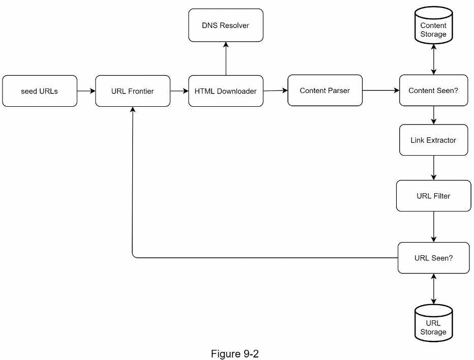

# Chapter 9: Thiết Kế một Web Crawler

Ở chương này ta sẽ tập trung thiết kế một web crawler. Một web crawler (trình thu thập thông tin web) còn biết đến như một robot. Nó được dùng bởi các công cụ tìm kiếm để khám phá nội dung mới cập nhật từ web. Nội dung có thể là trang web, hình ảnh, video, file PDF,... Một web crawler khởi động bằng cách thu thập một vài web page và theo dõi liên kết của các trang web này để thu thập nội dung mới. Ảnh bên dưới mô tả quá trình crawl.

Một crawler được dùng cho các mục đích sau:
- **Search engine indexing:** Đây là trường hợp sử dụng phổ biến nhất. Trình thu thập thông tin thu thập các trang web để tạo chỉ mục cục bộ cho các công cụ tìm kiếm. Ví dụ: Googlebot là trình thu thập thông tin web đằng sau công cụ tìm kiếm Google.
- **Web archiving:** Đây là quá trình thu thập thông tin từ web để bảo toàn dữ liệu cho những lần sử dụng sau. Ví dụ, nhiều thư viện quốc gia chạy trình thu thập thông tin để lưu trữ các trang web. Các ví dụ đáng chú ý là Thư viện Quốc hội Hoa Kỳ [1] và kho lưu trữ web của Liên minh Châu Âu [2].
- **Web mining:** Sự phát triển bùng nổ của web mang lại cơ hội chưa từng có cho việc khai thác dữ liệu. Khai thác web giúp khám phá kiến thức hữu ích từ internet. Ví dụ: các công ty tài chính hàng đầu sử dụng trình thu thập thông tin để tải xuống các cuộc họp cổ đông và báo cáo hàng năm để tìm hiểu các sáng kiến quan trọng của công ty.
- **Web monitoring:** Trình thu thập thông tin giúp theo dõi các vi phạm bản quyền và nhãn hiệu qua Internet. Ví dụ: Digimarc [3] sử dụng trình thu thập thông tin để khám phá các tác phẩm và báo cáo vi phạm bản quyền.

Mức độ phức tạp của việc phát triển trình thu thập thông tin web phụ thuộc vào quy mô mà chúng ta dự định hỗ trợ. Đó có thể là một dự án trường học nhỏ, chỉ mất vài giờ để hoàn thành hoặc một dự án khổng lồ đòi hỏi sự cải tiến liên tục từ một nhóm kỹ sư chuyên dụng. Như vậy, chúng ta cùng tìm hiểu thang đo và các tính năng cần hỗ trợ bên dưới.

## 1. Hiểu vấn đề và thiết lập phạm vi

Thuật toán cơ bản của một web crawler đơn giản như sau:
1. Cho một tập URL, tải tất cả địa chỉ trang web bằng các URL.
2. Mở rộng URL từ các trang web này.
3. Thêm các URL mới vào danh sách URL để tải xuống. Lặp lại 3 bước này.

Một web crawler có hoạt động thực sự đơn giản như thuật toán cơ bản này không? Không hề. Thiết kế một web crawler có khả năng mở rộng rộng lớn là một nhiệm vụ cực kỳ phức tạp. Không ai có thể thiết kế một web crawler lớn trong thời gian phỏng vấn. Trước khi bắt đầu thiết kế, chúng ta phải đặt câu hỏi để hiểu các yêu cầu và thiết lập phạm vi thiết kế:

- **Ứng viên:** Mục đích chính của web crawler là gì? Nó có được sử dụng để đánh chỉ mục công cụ tìm kiếm, khai thác dữ liệu hay thứ gì khác không?
- **Người phỏng vấn:** Đánh chỉ mục công cụ tìm kiếm.

- **Ứng viên:** Web crawler thu thập bao nhiêu trang web mỗi tháng?
- **Người phỏng vấn:** 1 tỷ trang.

- **Ứng viên:** Gồm những dạng nội dung nào? Chỉ HTML hay các loại nội dung khác như PDF và hình ảnh?
- **Người phỏng vấn:** Chỉ HTML.

- **Ứng viên:** Chúng ta sẽ xem xét các trang web mới được thêm vào hay đã được chỉnh sửa?
- **Người phỏng vấn:** Có, chúng ta nên xem xét các trang web mới được thêm vào hoặc chỉnh sửa.

- **Ứng viên:** Chúng ta có cần lưu trữ các trang HTML được thu thập thông tin từ web không?
- **Người phỏng vấn:** Có, tối đa 5 năm.

- **Ứng viên:** Chúng ta xử lý các trang web có nội dung trùng lặp như thế nào?
- **Người phỏng vấn:** Nên bỏ qua các trang có nội dung trùng lặp.

Trên đây là một số câu hỏi mẫu mà bạn có thể hỏi người phỏng vấn của mình. Điều quan trọng là phải hiểu các yêu cầu và làm rõ những điều còn mơ hồ. Ngay cả khi bạn được yêu cầu thiết kế một sản phẩm đơn giản như web crawler, bạn và người phỏng vấn của bạn có thể không có cùng giả định.

Bên cạnh các chức năng cần làm rõ với người phỏng vấn, bạn cũng cần lưu ý các đặc điểm sau của một web crawler tốt:
- Khả năng mở rộng: Trang web rất lớn. Có hàng tỷ trang web trên mạng. Thu thập thông tin web sẽ cực kỳ hiệu quả bằng cách sử dụng song song.
- Tính chắc chắn: Trang web có rất nhiều cạm bẫy. HTML kém, server không phản hồi, sự cố, liên kết độc hại,... đều phổ biến. Web crawler phải xử lý tất cả các trường hợp đó.
- Lịch sự: Web crawler không nên đưa ra quá nhiều yêu cầu đối với một trang web trong một khoảng thời gian ngắn.
- Khả năng mở rộng: Hệ thống linh hoạt nên cần có những thay đổi tối thiểu để hỗ trợ các loại nội dung mới. Ví dụ, nếu chúng ta muốn thu thập dữ liệu các file hình ảnh trong tương lai, chúng ta không cần phải thiết kế lại toàn bộ hệ thống.

### Ước lượng nhanh

Các ước tính sau dựa trên các giả định, điều quan trọng là bạn và người phỏng vấn phải có chung tư tưởng.
- Giả sử tải 1 tỷ trang web mỗi tháng.
- QPS: 1,000,000,000 / 30 ngày / 24 giờ / 3600 giây = ~400 trang trên giây.
- QPS cao nhất: 2 * QPS = 800
- Giả sử kích cở trung bình của trang web là 500 KB.
- 1 tỷ trang web * 500 KB = 500 TB lưu trữ hàng tháng.
- Giả sử dữ liệu dùng trong 5 năm. 500 TB * 12 tháng * 5 năm = 30 PB. Cần lưu trữ 30 PB để dùng cho 5 năm.

## 2. Đề xuất thiết kế high-level

Khi các yêu cầu đã rõ ràng, chúng tôi chuyển sang thiết kế high-level. Lấy cảm hứng từ các nghiên cứu trước đây về thu thập thông tin web [4] [5], chúng tôi đề xuất một thiết kế như trong Hình 9-2.

Đầu tiên, ta khám phá mỗi thành phần thiết kế để hiểu chức năng của chúng. Sau đó ta xem xét luồng hoạt động của crawler theo từng bước.

### Seed URLs

Một web crawler sử dụng seed URL như điểm bắt đầu cho quá trình thu thập thông tin. Ví dụ, dể thu thập thông tin tất cả các trang web từ trang web của trường đại học, một cách trực quan để chọn seed URL là sử dụng tên miền của trường đại học.

Để thu thập dữ liệu toàn bộ trang web, chúng ta cần phải sáng tạo trong việc chọn các seed URL. Một seed URL tốt đóng vai trò là điểm khởi đầu tốt mà web crawler có thể sử dụng để duyệt qua nhiều liên kết nhất có thể. Chiến lược chung là chia toàn bộ không gian URL thành những không gian nhỏ hơn. Cách tiếp cận được đề xuất đầu tiên dựa trên địa phương vì các quốc gia khác nhau có thể có các trang web phổ biến khác nhau. Một cách khác là chọn các seed URL dựa trên các chủ đề; ví dụ: chúng tôi có thể chia không gian URL thành mua sắm, thể thao, chăm sóc sức khỏe, ... Lựa chọn seed URL là một câu hỏi mở. Bạn không nên mong đợi việc đưa ra câu trả lời hoàn hảo. Chỉ cần nói ra suy nghĩ của mình.

### URL Frontier

Hầu hết các web crawler hiện đại chia trạng thái thu thập thông tin thành hai phần: sẽ tải xuống và đã tải xuống. Thành phần lưu trữ các URL sẽ tải xuống gọi là URL Frontier. Bạn có thể xem nó như một hàng đợi FIFO (First-in-First-out). Để biết chi tiết hãy xem ở phần chuyên sâu.

### HTML Downloader

Trình tải xuống HTML tải các trang web từ internet. Các URL đó được cung cấp bởi URL Frontier.

### DNS Resolver

Để tải xuống một trang web, một URL phải được dịch thành địa chỉ IP. Trình tải xuống HTML gọi DNS Resolver để lấy địa chỉ IP tương ứng cho URL. Ví dụ: URL `www.wikipedia.org` được chuyển đổi thành địa chỉ IP 198.35.26.96 kể từ ngày 3/5/2019.

### Content Parser

Sau khi một trang web được tải xuống, nó phải được phân tích cú pháp và xác thực vì các trang web không đúng định dạng có thể gây ra sự cố và lãng phí dung lượng lưu trữ. Việc triển khai content parser - trình phân tích cú pháp nội dung, trong server crawl sẽ làm chậm quá trình thu thập thông tin. Do đó, trình phân tích cú pháp nội dung là một thành phần riêng biệt.

### Content Seen

